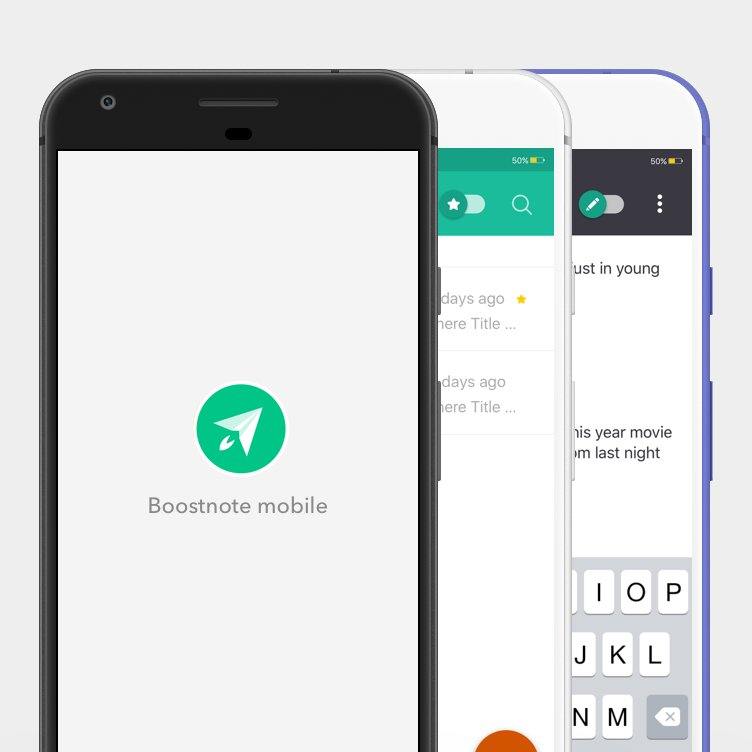

## [Boostnote](https://boostnote.io/) for iOS and Android app that build with React Native.

　

## Authors & Maintainers
- [Kohei TAKATA](https://github.com/kohei-takata)
- [asmsuechan](https://github.com/asmsuechan)
- [Kazu Yokomizo](https://github.com/kazup01)

## Contributors
[Great contributors](https://github.com/BoostIO/Boostnote/graphs/contributors) :tada:

## More Information
* [Website](https://boostnote.io) : Mac, Windows and Linux apps are available 💻
* [10hz](https://boostnote.io/team/) : Boostnote for the creative hacker teams. Share your markdown notes and snippets instantly with your team. 👪
* [Support us via Bountysource](https://salt.bountysource.com/teams/boostnote) : Thank you for your support 🎉
* Copyright (C) 2017 Maisin&Co.

## License
[MIT](https://github.com/Boostnote/boostnote-mobile/blob/master/LICENSE).

### Want to contribute or need to see some improvements?
We would love that, please create an issue or send a PR.
